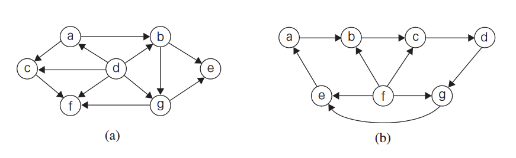

<center><h1> Cse 381 Portfolio </h1></center>

<center><h2>Author: Samuel Witt </h2></center>

<center><h2>Date: March 7, 2023 </h2></center>

</center></center>

<div style="page-break-before:always"></div>

<center><h2>Week 1</h2></center>

### 01/05/23

Hello World!

Getting things set up.

<div style="page-break-before:always"></div>

<center><h2>Week 2</h2></center>

### 01/10/23

Euclid’s algorithm:

1. If m ¡ n, exchange m and n.
2. Divide m by n and get the reamiander, r. If r=0, report n as GCD
   of m and n.
3. Replace m by n and replace n by r. Repeat Step 2.

### 01/12/23

Binary Search:

1. Let min = 1 and max = n
1. Average max and min rounded down
1. If correct stop
1. If guess low set min to 1 + guess
1. If guess high set min to 1 - guess
1. Go back to step 2

<div style="page-break-before:always"></div>

<center><h2>Week 3</h2></center>

### 01/17/23

#### Binary Search

```{python}
import random

def binary_search(list, target):
   low = 0
   high = len(list) - 1
   x = 0

   while low <= high:
      x += 1
      mid = (low + high) // 2

      if low > high:
         print(f'Number {target} is not found in list')
         break
      elif list[mid] < target:
         low = mid + 1
      elif list[mid] > target:
         high = mid - 1
      else:
         print(f'Number {target} found in {x} tries!')
         break

def main():
   my_list = random.sample(range(1, 50), 10)
   my_list.sort()

   print(f'Your list is {my_list}')
   num = int(input('Enter a number: '))

   binary_search(my_list, num)

if __name__ == "__main__":
   main()
```


### 01/19/23

#### Problem 1.1.6

Q:

-  Find gcd(31415, 14142) by applying Euclid’s algorithm.
-  Estimate how many times faster it will be to find gcd(31415, 14142) by Euclid’s algorithm compared with the algorithm based on checking consecutive integers from min{m, n} down to gcd(m, n).

A:

-  1. 31415 = 2 \* 14142 + 3151
   2. 14142 = 4 \* 3151 + 1190
   3. 3151 = 2 \* 1190 + 771
   4. 1190 = 1 \* 771 + 419
   5. 771 = 1 \* 419 + 352
   6. 419 = 1 \* 352 + 67
   7. 352 = 5 \* 67 + 37
   8. 67 = 1 \* 37 + 30
   9. 37 = 1 \* 30 + 7
   10.   30 = 4 \* 7 + 2
   11.   7 = 3 \* 2 + 1
   12.   2 = 2 \* 1 + 0

-  The algorithm based on checking consecutive integers involves checking every integer between min(m, n) and gcd(m, n) to see if it divides both m and n. This means the number of steps required is proportional to gcd(m, n) - min(m, n).

#### Problem 1.1.12

Q: Locker doors There are n lockers in a hallway, numbered sequentially from 1 to n. Initially, all the locker doors are closed. You make n passes by the lockers, each time starting with locker #1. On the ith pass, i = 1, 2, . . . , n, you toggle the door of every ith locker: if the door is closed, you open it; if it is open, you close it. After the last pass, which locker doors are open and which are closed? How many of them are open?

A:

There are n lockers in a hallway numbered from 1 to n. Initially, all locker doors are closed. In each of the n passes, starting with the first locker, you toggle the door of every ith locker, where i is the number of the pass. For example, on the first pass, you toggle every locker; on the second pass, you toggle every second locker, and so on. After the n passes, which locker doors are open and which are closed, and how many of them are open?

The lockers that are open are the ones whose number has an odd number of factors. The lockers whose numbers are perfect squares have an odd number of factors, and they end up closed. All other lockers end up open. Therefore, the number of open lockers is equal to the total number of lockers (n) minus the number of perfect squares between 1 and n (⌊√n⌋).

#### Problem 1.2.1

Q: Old World puzzle A peasant finds himself on a riverbank with a wolf, a goat, and a head of cabbage. He needs to transport all three to the other side of the river in his boat. However, the boat has room for only the peasant himself and one other item. In his absence, the wolf would eat the goat, and the goat would eat the cabbage. Solve this problem for the peasant or prove it has no solution.

A:

1. Take the goat over.
1. Return to other side.
1. Take the wolf or cabbage over.
1. Return with the goat.
1. Take the cabbage or wolf over.
1. Return.
1. Take goat over.

#### Problem 2.2.1

Q: Use the most appropriate notation among O, Θ, and Ω to indicate the time efficiency class of sequential search (see Section 2.1)

1. in the worst case.
2. in the best case.
3. in the average case

A:

1. O(n), since in the worst case scenario the algorithm will have to iterate through the entire list to find the desired element.

2. Θ(1), since in the best case scenario the desired element will be the first element of the list and the algorithm will return immediately.

3. O(n), since in the average case scenario the algorithm will have to iterate through about half of the list to find the desired element, which is still proportional to n.

<div style="page-break-before:always"></div>

<center><h2>Week 4</h2></center>

### 01/24/23

Grade Claim 1

### 01/26/23

#### Problem 1.1.6

Completed on January 19

#### Problem 1.1.12

Completed on January 19

#### Problem 1.2.6

Q: Describe the algorithm used by your favorite ATM machine in dispensing cash.

A:

-  The user inserts their ATM card into the machine and enters their PIN
-  The machine verifies the user's information and allows them to proceed with the transaction
-  The user selects the option to withdraw cash and enters the desired amount
-  The machine checks if the requested amount is available in the dispensing unit
-  If the requested amount is available, the machine dispenses the cash and update the account balance
-  If the requested amount is not available, the machine informs the user and the transaction is terminated
-  The machine returns the ATM card to the user and completes the transaction

#### Problem 1.4.2

Q: If you have to solve the searching problem for a list of n numbers, how can you take advantage of the fact that the list is known to be sorted? Give separate answers for

1. lists represented as arrays.
2. lists represented as linked lists.

A:

1. If the list is represented as an array, we can take advantage of the fact that it is sorted by using binary search instead of linear search. Binary search works by repeatedly dividing the sorted list in half until the target value is found, or it is determined that the target value is not in the list. Binary search has a time complexity of O(log n), which is faster than the linear search algorithm used for unsorted arrays.

2. If the list is represented as a linked list, we can still use binary search, but we would need to modify the algorithm slightly to take advantage of the linked list structure. One approach is to use two pointers: one pointer moves through the list one node at a time (like in linear search), while the other pointer moves through the list by jumping to the middle node of the remaining portion of the list. This approach still has a time complexity of O(log n), but requires extra space for the two pointers. Alternatively, we can perform linear search but stop as soon as we reach a node whose value is greater than the target value, since we know that all subsequent nodes will also have values greater than the target value due to the list being sorted. This approach has a time complexity of O(n), but can potentially be faster in practice if the target value is near the beginning of the list.

#### Problem 2.1.4a

Q: Glove selection There are 22 gloves in a drawer: 5 pairs of red gloves, 4 pairs of yellow, and 2 pairs of green. You select the gloves in the dark and can check them only after a selection has been made. What is the smallest number of gloves you need to select to have at least one matching pair in the best case? In the worst case?

A:

-  The smallest number of gloves you need to select to have at least one matching pair in the best case is 3. In this case, you can select two gloves of different colors, and then the third glove must match one of the previous two gloves.

-  In the worst case, you need to select 12 gloves. This can happen if you select one glove from each pair of red and yellow gloves, and then select two gloves from each pair of green gloves. This way, you end up with 5 red gloves, 4 yellow gloves, and 4 green gloves, but none of them match. The next glove you select will complete a pair.

#### Problem 2.1.4b

Q: Missing socks Imagine that after washing 5 distinct pairs of socks, you discover that two socks are missing. Of course, you would like to have the largest number of complete pairs remaining. Thus, you are left with 4 complete pairs in the best-case scenario and with 3 complete pairs in the worst case. Assuming that the probability of disappearance for each of the 10 socks is the same, find the probability of the best-case scenario; the probability of the worst-case scenario; the number of pairs you should expect in the average case.

A:

-  To find the probability of the best-case scenario, we assume that the missing socks are from different pairs. This means that there are 4 complete pairs remaining, and the probability of this happening is: P(best-case scenario) = 5/45 = 1/9
-  To find the probability of the worst-case scenario, we assume that the missing socks are from the same pair. This means that there are 3 complete pairs remaining, and the probability of this happening is: P(worst-case scenario) = 40/45 = 8/9
-  We can take the probability of 4 and 3 to find average case. 4 _ 1/9 + 3 _ 8/9 = 4/9 + 24/9 = 28/9

#### Problem 2.1.9

Q: For each of the following pairs of functions, indicate whether the first function of each of the following pairs has a lower, same, or higher order of growth (to within a constant multiple) than the second function.

1. n(n + 1) and 2000n^2
2. 100n^2 and 0.01n^3
3. logv2n and $ln n$ln_n
4. log^2v2n and logv2 n^2
5. 2^n−1 and 2^n
6. (n − 1)! and n!

A:

1. n(n+1) has a lower order of growth than 2000n^2. We can see this by simplifying n(n+1) to n^2 + n, which is still less than 2000n^2 for sufficiently large n
2. 100n^2 has a lower order of growth than 0.01n^3. We can see this by simplifying 0.01n^3 to n^3/100, which is much larger than 100n^2 for sufficiently large n
3. log2 n and ln n have the same order of growth. This is because they differ only by a constant factor: ln n = loge n = log2 n / log2 e
4. log22n and log2 n^2 have the same order of growth. This is because log22n = 1 + log2 n, and 1 is a constant factor that does not affect the order of growth
5. 2n−1 has a lower order of growth than 2n. This is because 2n−1 = (2/2) \* 2n = 2^(n-1), which is half of 2n and thus has a lower order of growth
6. (n − 1)! has a lower order of growth than n!. This is because n! = n\*(n-1)! and n is a constant factor larger than n-1, so n! grows faster than (n-1)!

#### Problem 2.2.1

Completed on January 19

#### Problem 2.2.2

Q: Use the informal definitions of O, Θ, and Ω to determine whether the following assertions are true or false.

1. n(n + 1)/2 ∈ O(n^3)
2. n(n + 1)/2 ∈ O(n^2)
3. n(n + 1)/2 ∈ Θ(n^3)
4. n(n + 1)/2 ∈ Ω(n)

A:

1. True: We can see that n(n+1)/2 ≤ n^2/2 + n^3/2 for n ≥ 1, so n(n+1)/2 is bounded above by a constant multiple of n^3 for sufficiently large n.

2. True: n(n+1)/2 ≤ n^2/2 + n^2/2 for n ≥ 1, so n(n+1)/2 is bounded above by a constant multiple of n^2 for sufficiently large n.

3. False: To show that n(n+1)/2 is not bounded below by a constant multiple of n^3, we can note that n(n+1)/2 is always greater than n^2/2, which is not bounded below by a constant multiple of n^3.

4. True: n(n+1)/2 ≥ n^2/2 for n ≥ 1, so n(n+1)/2 is bounded below by a constant multiple of n.

<div style="page-break-before:always"></div>

<center><h2>Week 5</h2></center>

### 01/31/23

Homework review in class.

### 02/02/23

Brute force ugga booga. Not the best solution to the problem.

#### Selection Sort

```{python}
import random

def selection_sort(list):
   for i in range(len(list)):
      min_idx = i
      for j in range(i + 1, len(list)):
         if list[j] < list[min_idx]:
            min_idx = j
      list[i], list[min_idx] = list[min_idx], list[i]
      print(f'During sorting: {list}')
   return list


def main():
   my_list = random.sample(range(1, 50), 10)
   print(f'Before sorting: {my_list}')

   selection_sort(my_list)

   print(f'After sorting:  {my_list}')

if __name__ == "__main__":
   main()
```

<div style="page-break-before:always"></div>

<center><h2>Week 6</h2></center>

### 02/07/23

#### Insertion Sort

```{python}
import random

def insertion_sort(list):

   for i in range(1, len(list)):
      key = list[i]
      j = i - 1

      while j >= 0 and list[j] > key:
         list[j + 1] = list[j]
         j -= 1
      list[j + 1] = key

      print(f'During sorting: {list}')


def main():
   my_list = random.sample(range(1, 50), 10)
   print(f'Before sorting: {my_list}')

   insertion_sort(my_list)

   print(f'After sorting: {my_list}')

if __name__ == "__main__":
   main()
```

### 02/09/23

Showed code to class. Then we talked about the difference between for loop and while loop when using Insertion Sort.

<div style="page-break-before:always"></div>

<center><h2>Week 7</h2></center>

### 02/14/23

No Class.

### 02/16/23

Grade Claim 2

<div style="page-break-before:always"></div>

<center><h2>Week 8</h2></center>

### 02/21/23

No Class.

### 02/23/23

#### Problem 3.1.3

Q: For each of the algorithms in Problems 4, 5, and 6 of Exercises 2.3, tell whether
or not the algorithm is based on the brute-force approach.

A:

4. Yes, the algorithm is based on the brute-force approach. It checks every item in the list with no escape clause.

5. Yes, the algorithm is based on the brute-force approach. It checks every item in the list with no escape clause.

6. No, the algorithm is based on the brute-force approach. It has a escape clause.

#### Problem 3.1.7

Q: A stack of fake coins There are n stacks of n identical-looking coins. All of the coins in one of these stacks are counterfeit, while all the coins in the other stacks are genuine. Every genuine coin weighs 10 grams; every fake weighs 11 grams. You have an analytical scale that can determine the exact weight of any number of coins.

-  Devise a brute-force algorithm to identify the stack with the fake coins and determine its worst-case efficiency class.
-  What is the minimum number of weighings needed to identify the stack with the fake coins?

A:

-  One way to identify the stack with the fake coins is to weigh every stack individually. To do this, we can take each stack and weigh it against a known stack of genuine coins. If a stack weighs more than the genuine stack, we know it contains fake coins.
-  To identify the stack with the fake coins in the fewest number of weighings, we can use a binary search approach. We can start by weighing half of the stacks against the other half. If one half weighs more, we know it contains the fake coins. If they weigh the same, we repeat the process with the half that weighed the same. We continue this process until we identify the stack with the fake coins.

#### Problem 3.1.8

Q: Sort the list E, X, A, M, P , L, E in alphabetical order by selection sort

A:

1. Find the smallest element which is 'A', swap with 'E'.
   -  The list now looks like this: [A, X, E, M, P, L, E].
2. Find the smallest element which is 'E', swap with 'X'.
   -  The list now looks like this: [A, E, X, M, P, L, E].
3. Find the smallest element which is 'E', swap with 'M'.
   -  The list now looks like this: [A, E, E, X, P, L, M].
4. Find the smallest element which is 'L', swap with 'P'.
   -  The list now looks like this: [A, E, E, L, X, P, M].
5. Find the smallest element which is 'M', swap with 'X'.
   -  The list now looks like this: [A, E, E, L, M, P, X].
6. Find the smallest element which is 'P', swap with 'M'.
   -  The list now looks like this: [A, E, E, L, M, P, X].

#### Problem 3.1.9

Q: Is selection sort stable?

A: Selection sort is generally not stable. A sorting algorithm is stable if it maintains the relative order of equal elements in the sorted list as they appear in the original list. In other words, if two elements are equal in the original list and one comes before the other, a stable sort will ensure that the element that comes first in the original list also comes first in the sorted list.

#### Problem 4.1.1

Q: Ferrying soldiers A detachment of n soldiers must cross a wide and deep river with no bridge in sight. They notice two 12-year-old boys playing in a rowboat by the shore. The boat is so tiny, however, that it can only hold two boys or one soldier. How can the soldiers get across the river and leave the boys in joint possession of the boat? How many times need the boat pass from shore to shore?

A:

-  One boy crosses the river.
-  One soldier crosses the river.
-  The other boy crosses the river.
-  Both boys cross the river.
-  Rinse in repeat netting one soldier each time.
-  Total number of times is soldiers \* 4 = 24

#### Problem 4.2.1

Q: Apply the DFS-based algorithm to solve the topological sorting problem for the following digraphs:



A:

-  GRAPH A

   -  a: [b, c]
   -  b: [g, e]
   -  c: [f]
   -  d: [a, b, c, f, g]
   -  g: [e, f]
   -  Sorted graph: [d, a, c, b, g, f, e]

-  GRAPH B
   -  a: [b]
   -  b: [c]
   -  c: [d]
   -  d: [g]
   -  e: [a]
   -  f: [b, c, e, g]
   -  g: [e]
   -  Sorted graph: [f, b, c, d, g, e]
   -  a is never visited.

<div style="page-break-before:always"></div>

<center><h2>Week 9</h2></center>

### 02/28/23

Homework review in class.

#### Topological Sort

```{python}
from collections import defaultdict

class Graph:
   def __init__(self):
      self.graph = defaultdict(list)

   def addEdge(self, u, v):
      self.graph[u].append(v)

   def _topologicalSort(self, v, visited, stack):
      visited[v] = True

      for i in self.graph[v]:
         if not visited[i]:
            self._topologicalSort(i, visited, stack)
            print(f'Stack: {stack}')

      stack.append(v)

   def topologicalSort(self):
      visited = {node: False for node in self.graph}
      stack = []
      nodes = sorted(self.graph.keys())

      for node in nodes:
         if not visited[node]:
            self._topologicalSort(node, visited, stack)
            print(f'Stack: {stack}')

      print()
      print('Sorted nodes:')
      print(f'Stack: {stack[::-1]}')

   def __str__(self):
      s = ''
      for node in self.graph:
         s += str(node) + ': ' + str(self.graph[node]) + '\n'
      return s

def main():
   graph = Graph()
   graph.addEdge('a', 'b')
   graph.addEdge('b', 'c')
   graph.addEdge('c', 'd')
   graph.addEdge('d', 'g')
   graph.addEdge('e', 'a')
   graph.addEdge('f', 'b')
   graph.addEdge('f', 'c')
   graph.addEdge('f', 'e')
   graph.addEdge('f', 'g')
   graph.addEdge('g', 'e')

   print(graph)

   graph.topologicalSort()


if __name__ == "__main__":
   main()
```

### 03/02/23

#### Russian Peasant Multiplication

```{python}
def russian(a, b):
   x = 0

   while b > 0:
      if (b & 1):
         x = x + a

      a = a << 1
      b = b >> 1

   return x

def main():
   a = 146
   b = 37

   print(russian(a, b))

if __name__ == "__main__":
   main()
```

<div style="page-break-before:always"></div>
<center><h2>Week 10</h2></center>

### 03/07/23

#### Quick Sort

```{python}
import random

def quick_sort(list):
   # escape clause
   if len(list) <= 1:
      return list

   # set variables
   pivot = list[0]
   smaller = []
   larger = []

   # check every value past 1 this will exclude 0
   for i in list[1:]:
      if i < pivot:
         smaller.append(i)
      else:
         larger.append(i)

   smaller_final = quick_sort(smaller)
   larger_final = quick_sort(larger)
   list_final = smaller_final + [pivot] + larger_final

   return list_final

def main():
   my_list = random.sample(range(1, 50), 10)
   print(f'Before sorting:  {my_list}')

   my_list = quick_sort(my_list)

   print(f'After sorting: {my_list}')

if __name__ == "__main__":
   main()
```

#### Merge Sort

```{python}
import random

def _merge_sort(left_list, right_list):
   result_list = []
   i = 0
   j = 0

   while i < len(left_list) and j < len(right_list):
      # Add the smaller of the two lists to the result list
      if left_list[i] < right_list[j]:
         result_list.append(left_list[i])
         i += 1
      else:
         result_list.append(right_list[j])
         j += 1

   result_list += left_list[i:]
   result_list += right_list[j:]

   print(f'During sorting: {result_list}')

   return result_list

def merge_sort(list):
   # escape clause
   if len(list) <= 1:
      return list

   # set variables
   mid = len(list) // 2
   left_list = list[:mid]
   right_list = list[mid:]

   left_list = merge_sort(left_list)
   right_list = merge_sort(right_list)

   return _merge_sort(left_list, right_list)

def main():
   my_list = random.sample(range(1, 50), 10)
   print(f'Before sorting:  {my_list}')

   my_list = merge_sort(my_list)

   print(f'After sorting: {my_list}')

if __name__ == "__main__":
   main()
```

#### Problem 5.1.1

Q:

1. Write pseudocode for a divide-and-conquer algorithm for finding the position of the largest element in an array of n numbers.
2. What will be your algorithm’s output for arrays with several elements of the largest value?
3. Set up and solve a recurrence relation for the number of key comparisons made by your algorithm.
4. How does this algorithm compare with the brute-force algorithm for this problem?

A:

1.

```
function(list, start, end)

   if start != end
      mid = (start + end) / 2
      x = function(list, start, mid)
      y = function(list, mid + 1, end)
      if list[x] > list[y]
         return i
      else
         return j
```

2. The algorithm will return the any of the elements of the largest value. This means duplicate values will not be known.

3. The algorithm performs two recursive calls on subarrays of size n/2, and then performs one additional comparison to determine which of the two halves has the larger maximum element. T(n) = 2T(n/2) + 1. This runs at Big O of O(n log n) time.

4. This algorithm has a better worst-case time complexity than the brute-force algorithm, which compares every element in the array to every other element to find the maximum.

#### Problem 5.1.2

Q:

1. Write pseudocode for a divide-and-conquer algorithm for finding values of both the largest and smallest elements in an array of n numbers.
2. Set up and solve (for n = 2^k) a recurrence relation for the number of key comparisons made by your algorithm.
3. How does this algorithm compare with the brute-force algorithm for this problem?

A:

1.

```
function(list, start, end)

   mid = (start + end) / 2
   (min1, max1) = function(list, start, mid)
   (min2, max2) = function(list, mid + 1, end)

   if list[min1] > list[min2]
      min = min1
   else
      min = min2

   if list[max1] > list[max2]
      max = max1
   else
      max = max2

   return (min, max)
```

2. For a input array of size n = 2^k the the number of key comparisons is 2k + 2. We can see this with T(n) = 2T(n/2) + 2 we divide the array and make two comparisons.

3. This algorithm has a better worst-case time complexity than the brute-force algorithm, which compares every element in the array to every other element to find the maximum. This is faster for larger numbered arrays than the brute-force algorithm.

#### Problem 5.2.5

Q: For the version of quicksort given in this section:

1. Are arrays made up of all equal elements the worst-case input, the bestcase input, or neither?
2. Are strictly decreasing arrays the worst-case input, the best-case input, or neither?

A:

1. Arrays made up of all equal elements are the worst-case input for this version of quicksort. When you pivot at the first element you end up with an array with no elements and one with all the other elements.

2. Arrays that are strictly decreasing arrays are the worst-case input for this version of quicksort. When you pivot at the first element you end up with an array with no elements and one with all the other elements.

### 03/09/23

#### Problem Reduction

lmc(m,n) = (m \* n) / gdc(m, n)

#### Learning Pulp

```{python}
import pulp as p

LB_Prob = p.LpProblem("Problem", p.LpMinimize)

x = p.LpVariable.dicts("x", ["x1", "x2", "x3"], lowBound=0)
y = p.LpVariable.dicts("y", ["y1", "y2", "y3"], lowBound=0)

LB_Prob += 2 * x["x1"] + 3 * y["y1"] >= 12
LB_Prob += -x["x2"] + y["y2"] <= 3
LB_Prob += x["x3"] >= 4
LB_Prob += y["y3"] <= 3

LB_Prob.setObjective(3 * x["x1"] + 5 * y["y1"])

status = LB_Prob.solve()

print(p.LpStatus[status])

print(p.value(x["x1"]))
print(p.value(x["x2"]))
print(p.value(x["x3"]))
```
